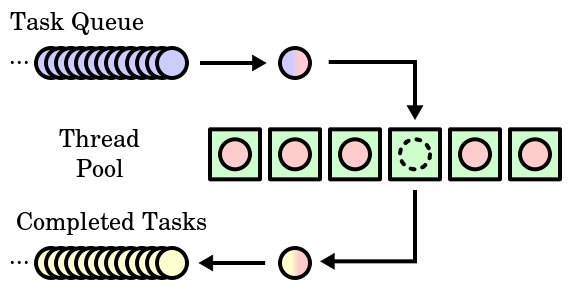

# Guide

This documentation helps using `microjob` with ease, involving simple and quick examples.

## Worker Pool



[Image taken from Wikipedia](https://en.wikipedia.org/wiki/Thread_pool#/media/File:Thread_pool.svg)

microjob implements the [Thread Pool pattern](https://en.wikipedia.org/wiki/Thread_pool), called worker pool.
The worker pool spawns a set of threads, default equals to the number of cpus.
It can be tuned with the config variable inside the start API:

```js
await start({ maxWorkers: 10 })
```

Invoking `job` on a function will put it on a task queue and then, when a worker is available, it will be executed, returning the desired result or an error.

### Auto self-healing

When a worker dies, the execution gets back to the caller and then the Worker Pool tries to spawn a new worker to refill its pool.

Every worker has 3 types of state:

- off
- spawning
- ready

If the Worker Pool finds workers in an "off" state, it tries to revive them.

## Setup

Before working with microjob you need to boot the worker pool:

```js
(async () => {
  const { start } = require("microjob");

  try {
    // start worker pool
    await start({ maxWorkers: 4 }); // you can also limit the available workers

    // ...
  } catch (err) {
    console.error(err);
  }
})();
```

`start` returns a promise and it will be resolved when all the threads are up and running, available to consume the internal jobs queue.

It's a good practice to await `start` thus to avoid race conditions.

## Sync job

The common and most used example is the sync job.
A sync job is just a function working in background, in another thread, avoiding to block the main thread with heavy CPU load, made of sync function calls.

```js
(async () => {
  const { start, job } = require("microjob");

  try {
    // start worker pool
    await start();

    // this function will be executed in another thread
    const res = await job(() => {
      let i = 0;
      for (i = 0; i < 1000000; i++) {
        for (let j = 0; j < 1000000; j++) {
          for (let k = 0; k < 1000000; k++) {}
        }
      }

      return i;
    });

    console.log(res); // 1000000
  } catch (err) {
    console.error(err);
  }
})();
```

## Async job

An asynchronous job is a task with at least one async call: for instance, a query to a DB, a HTTP request, a file system call, etc, and of course plus a heavy CPU load.

```js
(async () => {
  const { start, job } = require("microjob");

  try {
    // start worker pool
    await start();

    // this function will be executed in another thread
    const res = await job(async () => {
      let i = 0;
      for (i = 0; i < 1000000; i++) {
        for (let j = 0; j < 1000000; j++) {
          for (let k = 0; k < 1000000; k++) {
            await http.get("www.google.it");
          }
        }
      }

      return i;
    });

    console.log(res); // 1000000
  } catch (err) {
    console.error(err);
  }
})();
```

## Job data

Passing custom data to the job is quite easy as calling a function:

```js
(async () => {
  const { start, job } = require("microjob");

  try {
    // start worker pool
    await start();

    // this function will be executed in another thread
    const res = await job(
      data => {
        let i = 0;
        for (i = 0; i < data.counter; i++) {}

        return i;
      },
      { data: { counter: 1000000 } }
    );

    console.log(res); // 1000000
  } catch (err) {
    console.error(err);
  }
})();
```

Both data passed to the worker and the returned one are serialized with [v8 serializer](https://nodejs.org/api/v8.html#v8_v8_serialize_value): this means that only some JS data structures are allowed (for instance, functions and classes are forbidden).

## Job context

It's a common practice using the upper scope of the function's container to reuse the already defined variables.

**Context is evaluated inside the worker thread. This means it needs to be sanitized before passing it to microjob.
An attacker could perform a JS injection as described [in this issue](https://github.com/wilk/microjob/issues/2)**

**Another limitation with context is that currently (Node.js v11) does not provide a way to serialize and then rehydrate class instances at runtime via message passing (`postMessage`).
So it's not possible to pass custom class instances nor native class instances like `Date` using job context.**

Achieving the same result can be done by passing the context object:

```js
(async () => {
  const { start, job } = require("microjob");

  try {
    // start worker pool
    await start();

    // this function will be executed in another thread
    const counter = 1000000;
    const res = await job(
      () => {
        let i = 0;
        for (i = 0; i < counter; i++) {}

        return i;
      },
      { ctx: { counter } }
    );

    console.log(res); // 1000000
  } catch (err) {
    console.error(err);
  }
})();
```

## Forceful shutdown

When you don't need microjob anymore, you can shut it down with the `stop` function:

```js
(async () => {
  const { start, job, stop } = require("microjob");

  try {
    // start worker pool
    await start();

    // this function will be executed in another thread
    const counter = 1000000;
    const res = await job(
      () => {
        let i = 0;
        for (i = 0; i < counter; i++) {}

        return i;
      },
      { ctx: { counter } }
    );

    console.log(res); // 1000000
  } catch (err) {
    console.error(err);
  } finally {
    // stop worker pool
    await stop();
  }
})();
```

`stop` ensures that every worker of the worker pool is [terminated](https://nodejs.org/api/worker_threads.html#worker_threads_worker_terminate_callback).
